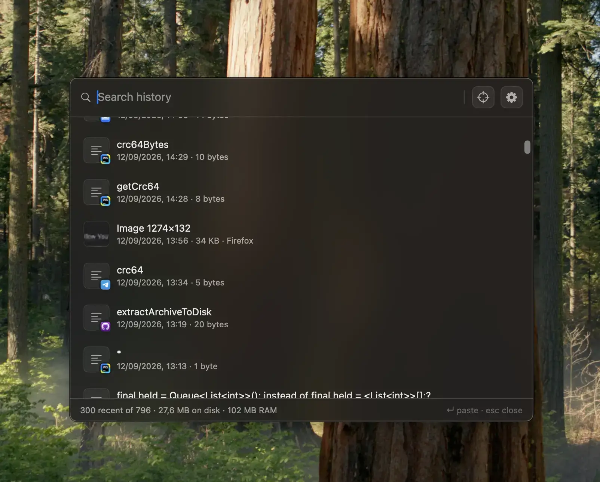
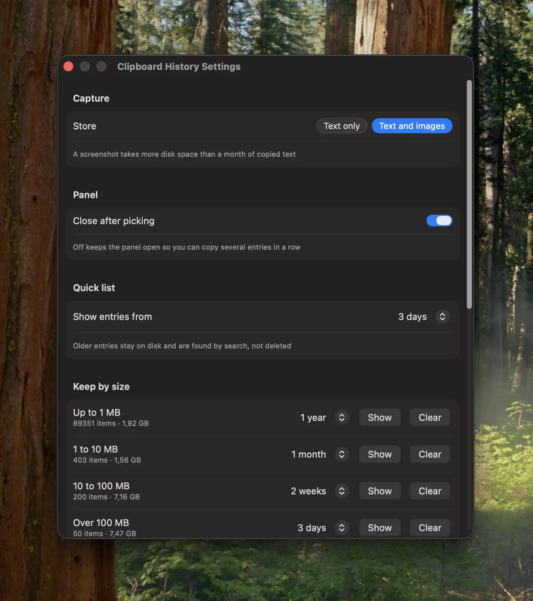
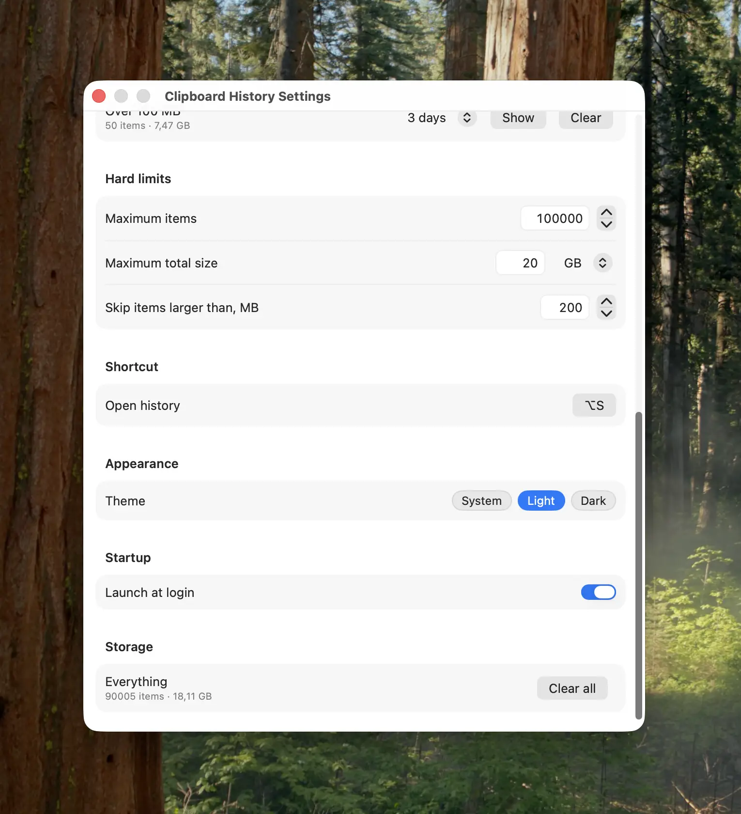
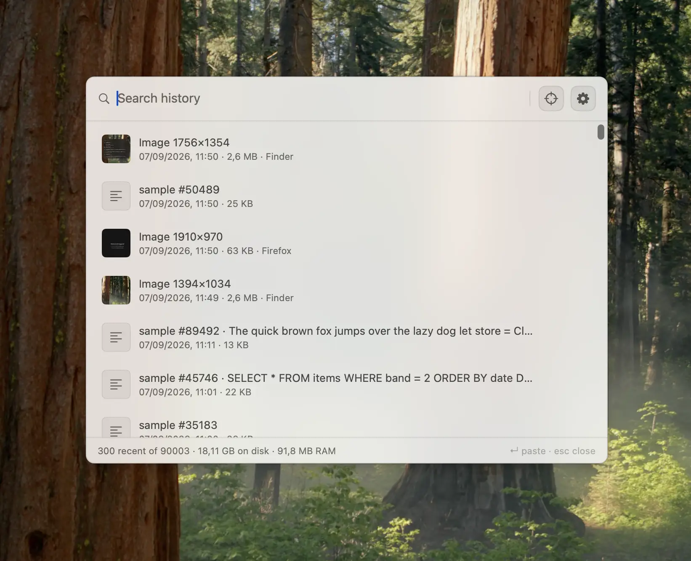

# Clipboard History

[](https://www.apple.com/macos/)
[](https://swift.org)
[](#building)

Clipboard History keeps everything you copy and lets you find it again by its text, the app it came from, its date or its size. It is a menu bar application with no dock icon, no network access and no dependencies beyond macOS itself.

Works on macOS Sonoma 14 or higher.



<sup>The panel over another window. The strip at the bottom reads `300 recent of 90002 · 18,1 GB on disk · 105,4 MB RAM`: ninety thousand entries and eighteen gigabytes of history, held in a hundred megabytes of memory.</sup>

* [Features](#features)
* [Install](#install)
* [Usage](#usage)
* [Search](#search)
* [Settings](#settings)
* [Advanced](#advanced)
  * [Where the data lives](#where-the-data-lives)
  * [Changing settings from the terminal](#changing-settings-from-the-terminal)
  * [Uninstalling](#uninstalling)
* [FAQ](#faq)
* [How it works](#how-it-works)
* [Building](#building)
* [License](#license)

## Features

* Text and images, with thumbnails and the app each one came from
* Search by content, source, date, time, size or image dimensions
* Substring search, not just whole words
* Separate retention for small and large entries, so screenshots expire before text does
* Scales to millions of entries without slowing down or growing in memory
* Keyboard driven, opens over any window without switching applications
* Everything stays on the machine

## Install

Install the Swift toolchain if it is not there already:

```sh
xcode-select --install
```

Then double-click **`Run.command`** in the project folder. It builds a release, stops any copy that is already running and launches the new one.

The icon appears in the menu bar. Nothing is added to the Dock.

Because the app is signed locally rather than with a developer certificate, macOS asks for confirmation the first time. If it refuses to open, right-click the app in `build/` and choose Open.

## Usage

1. <kbd>⌥</kbd> + <kbd>S</kbd> to open the panel, or click the menu bar icon and choose Open History.
2. Type to filter. Results narrow as you type; see [Search](#search) for what can be typed.
3. <kbd>↑</kbd> <kbd>↓</kbd> to move through the list, <kbd>↵</kbd> to copy the selected entry. Clicking an entry does the same.
4. <kbd>esc</kbd> closes the panel.
5. To delete an entry, click the trash icon that appears on hover, or right-click it and choose Delete.
6. To keep the panel open after picking, turn off **Close after picking** in settings, then copy several entries in a row.
7. To move the panel, drag it by the search bar or by the bottom strip. It stays where you leave it, on every screen. The crosshair button in the search bar brings it back to the centre.
8. <kbd>⌘</kbd> + <kbd>,</kbd> or the gear button opens settings. <kbd>esc</kbd> or <kbd>⌘</kbd> + <kbd>Q</kbd> closes the settings window without quitting the app.
9. To quit, choose Quit in the menu bar icon.

The bottom strip shows how many entries are in the list out of the total, how much disk the history occupies, and how much memory the app is using.

## Search

The search field matches several things at once, so there is no syntax to learn:

| Type | Matches |
|---|---|
| `terminal` | the word in an entry, and entries copied from Terminal |
| `ermina` | a substring inside a word |
| `клипборд` | any alphabet |
| `1394x1034` | an image by its pixel size, `x` in place of `×` |
| `2,6 MB` or `2,6MB` | an entry by its weight |
| `07-09-2026` | a date |
| `07/09`, `07.09`, `07 09` | the same date, separators do not matter |
| `11:50` or `1150` | a time |
| `September`, `Sep` | a month |

Entries whose **text** contains the query come first, then those whose **source app** matches, then those matching by **size or date**. Newest first within each group. A query that happens to look like a date does not push aside entries that actually contain those characters.

Search covers the whole history, including entries older than the quick list shows, and reads into the body of long entries when their preview alone finds nothing.

## Settings



<sup>Capture, Panel, Quick list and the first size bands.</sup>

**Capture** decides whether images are stored alongside text. A screenshot takes more disk space than a month of copied text, so this is worth turning off on a small drive.

**Panel** controls whether picking an entry closes the panel.

**Quick list** sets how far back the list reaches without searching. Older entries are not deleted; they are simply not in the list until searched for.

**Keep by size** gives every size band its own retention, because a line of text costs nothing to keep for a year and a 100 MB screenshot does not:

| Band | Default retention |
|---|---|
| Up to 1 MB | 1 year |
| 1 to 10 MB | 1 month |
| 10 to 100 MB | 2 weeks |
| Over 100 MB | 3 days |

**Show** opens the panel filtered to one band, **Clear** empties that band alone.



<sup>Hard limits, shortcut, appearance and storage. `Everything · 90005 items · 18,11 GB`, and the counters under each size band are read instantly at that size.</sup>

**Hard limits** cap the number of entries and the total size, oldest dropped first. Defaults are 1 000 000 entries and 20 GB, and the cap goes up to 5 000 000. **Skip items larger than** refuses to capture anything above that size at all, so a copied video never enters the history.

**Shortcut** records a new hot key when you press one.

**Appearance** switches theme without restarting; the change cross-fades rather than flashing.

**Startup** registers the app as a login item.

**Storage** shows the total and clears everything.

Lowering any limit applies to what is already stored, not just to future copies. Retention is also enforced every 10 minutes and whenever the panel opens.



<sup>The same window in the light theme. Switching cross-fades instead of flashing.</sup>

## Advanced

### Where the data lives

```
~/Library/Application Support/dev.swiftsoft.cliphistory/
├── history.db      metadata: rows, search indexes, totals
└── bodies/         the texts, images and thumbnails
```

Settings are in `UserDefaults` under `dev.swiftsoft.cliphistory`.

The database is plain SQLite, so the history can be inspected with any client:

```sh
sqlite3 ~/Library/Application\ Support/dev.swiftsoft.cliphistory/history.db \
  "SELECT date, kind, source, bytes, preview FROM items ORDER BY date DESC LIMIT 10"
```

Clipboard contents marked `org.nspasteboard.ConcealedType`, which is what password managers set, are never stored.

### Changing settings from the terminal

Everything in the settings window is a default and can be set without opening it. The app reads these at launch:

```sh
defaults write dev.swiftsoft.cliphistory maxItems -int 2000000
defaults write dev.swiftsoft.cliphistory maxTotalMB -int 40960
defaults write dev.swiftsoft.cliphistory maxItemMB -int 500
defaults write dev.swiftsoft.cliphistory captureImages -bool false
defaults write dev.swiftsoft.cliphistory memoryDays -int 7
defaults write dev.swiftsoft.cliphistory closeAfterPick -bool false
defaults write dev.swiftsoft.cliphistory retentionDays.huge -int 1
```

`memoryDays` and every `retentionDays.*` accept `0` for forever. The bands are `small`, `medium`, `large` and `huge`.

### Uninstalling

```sh
pkill -x ClipHistory
rm -rf "build/Clipboard History.app"
rm -rf ~/Library/Application\ Support/dev.swiftsoft.cliphistory
defaults delete dev.swiftsoft.cliphistory
```

## FAQ

### Why does the app keep running when I press ⌘Q?

<kbd>⌘</kbd> + <kbd>Q</kbd> closes the settings window only. A menu bar utility that quits on a shortcut pressed out of habit stops recording the clipboard without telling you. Quit deliberately from the menu bar icon.

### My hot key does nothing.

Another application has claimed the same combination. macOS gives it to whoever registered first, and there is no error. Pick a different combination in settings.

### Images are not being captured.

Check that **Store** in settings is set to Text and images, and that the image is smaller than **Skip items larger than**.

### The list is missing older entries.

The list only reaches back as far as **Show entries from** in settings. Everything older is still on disk and comes up in search. Raise that setting, or set it to Forever, if you want to scroll through it instead.

### Where did an entry go?

Either its size band reached its retention, or a hard limit dropped it as the oldest entry. Both are in settings; the size bands in **Keep by size** show how much each is holding.

### Does it survive a restart of the app?

Yes. Entries are committed as they are copied, and the database is checkpointed both on quit and when the app is stopped by a signal.

## How it works

Metadata is in SQLite, bodies are plain files beside it. A 100 MB image never passes through a database row, and the list never opens a file to draw itself.

| Technique | What it buys |
|---|---|
| Nothing held in memory, every list and count is a query | A million entries open as fast as ten, in ~10 MB of RAM |
| Trigram `fts5` index instead of the word tokenizer | `ermina` finds `Terminal`; the default tokenizer finds nothing |
| Three index tables instead of three columns of one | A date query costs 0.1 ms instead of 96 ms at a million rows |
| Counts and sizes maintained by triggers | Settings open in 0.02 ms instead of 24 ms |
| Partial index for the deep read | 0.17 ms instead of 256 ms when a search matches nothing |
| Body reads bounded to 16 KB from 15 entries | The window no longer freezes on a history of 160 MB entries |
| Thumbnails in AVIF where the system encodes it | ~1.5 KB per thumbnail instead of ~3.5 KB for JPEG, 2.3x less |
| 300 decoded thumbnails cached, encoding off the main thread | Scrolling never waits on the disk or on the encoder |
| 300 rows per query, answers cached per keystroke | The list is rebuilt once per redraw, not several times |
| `auto_vacuum=INCREMENTAL` | 683 MB back to 40 MB in 1.9 s after a large deletion |
| SHA-256 deduplication | Re-copying moves an entry to the top instead of storing it twice |

### Measured

On real stores of one and two million entries, 1.1 GB and 1.4 GB on disk:

| Operation | 1M entries | 2M entries |
|---|---|---|
| Open the store | 12.3 ms | 9.8 ms |
| First page of the list | 0.6 ms | 0.7 ms |
| Search a word | 1.7 ms | 2.7 ms |
| Search inside a word | 1.1 ms | 1.3 ms |
| Search matching nothing | 0.17 ms | 0.2 ms |
| Find a duplicate by digest | 0.006 ms | 0.008 ms |
| Store one copy | 1.8 ms | 1.1 ms |
| Delete one entry | 0.25 ms | 0.14 ms |
| Counters for the settings | 0.02 ms | 0.02 ms |
| Apply the limits | 0.01 ms | 0.01 ms |
| Memory held | 10 MB | 8.3 MB |

Typing into the search box, measured per character on the million-entry store:

| Typed | Before | After |
|---|---|---|
| `t` | 100.9 ms | 1.9 ms |
| `te` | 37.4 ms | 1.9 ms |
| `ter` | 12.9 ms | 1.1 ms |
| `terminal` | 0.8 ms | 0.8 ms |
| `qqz`, matching nothing | 65.2 ms | 9.7 ms |

A screen frame is 16 ms, so nothing here is visible while typing.

## Building

```sh
./Run.command             # build a release and restart the app
./build.sh                # build only, into build/Clipboard History.app
./build.sh --universal    # both architectures, as a release is built
swift build               # debug build
```

```
Sources/ClipHistory/
├── AppDelegate.swift           menu bar, settings window, main menu
├── ClipboardStore.swift        storage, search, limits
├── Database.swift              libsqlite3 wrapper
├── PasteboardWatcher.swift     pasteboard polling, source detection
├── HistoryPanel.swift          the panel window
├── HistoryView.swift           list, search, status strip
├── SettingsView.swift          settings window
├── Settings.swift              settings and size bands
├── HotKey.swift                global hot key, key names
├── Thumbnail.swift             thumbnails and their cache
├── OverlayScrollers.swift      scrollers
├── PanelBackdrop.swift         blurred panel backdrop
├── AppearanceTransition.swift  theme transition
├── HistoryFilter.swift         size band filter
├── ProcessMemory.swift         process memory for the status strip
└── main.swift                  entry point
```

## License

[PolyForm Strict 1.0.0](LICENSE).

Free for any noncommercial purpose. Modifying the code, building works based on it, redistributing it or using it commercially are not permitted.
